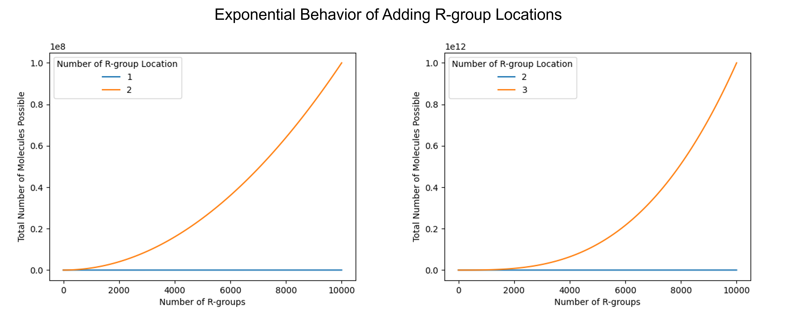

# Polymer Virtual Forward Synthesis Genetic Algorithm (pvfsga)

The goal of any genetic algorithm is to optimize the properties of some system by
mimicking how natural selection works. The pvfsga tries to optimize polymer properties,
(e.g., tensile strength, enthalpy, Young's modulus) so that the newly created polymer
can achieve some desired performance metric (for example, high strength and specific enthalpy values).
However, instead of designing polymers outright 
([like polyga](https://github.com/Ramprasad-Group/polyga/)), it tries to design molecules/monomers
that it will then convert into polymers via reaction templates.

The reason it operates in this way is because a challenge occurs when we solely generate
polymers: we don't know what monomer(s) should be used to create them. The idea behind
pvfsga is that we're creating a starting molecules we want to run through some
reactions we already have in mind, so we do not need to think about what monomer we
actually need to purchase to create the polymer.
Furthermore, by starting with initial monomers, the user can restrict the chemical space to molecules that polymerize into 
potentially recyclable polymers within the ring opening polymerization (ROP) class for example.

So, how does pvfsga work? Let's
say we have a reaction where we want to convert a cycloalkane into a polymer through ROP:

We begin with a scaffold, which in this case is a cycloalkane, containing specific functionalization sites marked as 1* and 2*. Adjacent to these sites, R-groups are attached to the scaffold. A global, user-defined list of R-groups is available, from which the GA can select to optimize the polymer properties. The generated Monomers are then polymerized through user-defined reaction schemes written with SMiles ARbitrary Target Specification (SMARTS). 

## GA or Brute Force?
Of course, we could enumerate over every possible combination, 
but each of the m potential locations will have n possible R groups, 
resulting in an O($n^m$) brute force run time. In the example where
there are only possible six R groups and three positions, that is only 216 possible
hypothetical polymers to test, but as n and m increase, an exponential increase occurs
(as can be seen in the figure below)

We see that if even for just 2 R group locations, we start to generate tens of millions of polymers
as the number of R groups possible reach 10,000. If there are 3 locations for R
groups, then even 1,000 R groups starts to generate billions of
hypothetical polymers. Fingerprinting and predicting the properties of every polymer becomes quickly daunting and highly demanding computationally even if parallelization is used. Therefore, we have developed a highly efficient genetic algorithm that rapidly and effectively explores the chemical space to produce polymers meeting target criteria, without the need to iterate through every possible combination.

In this document we provide an overview of the specific mechanisms of this ga 
[pvfsga overview](docs/pvfsga_explanation.md)  

In this document we present a tutorial on how to use this package:
[pvfsga tutorial](docs/how_to_run.md)  

## The Paper Associated

Attach Paper
