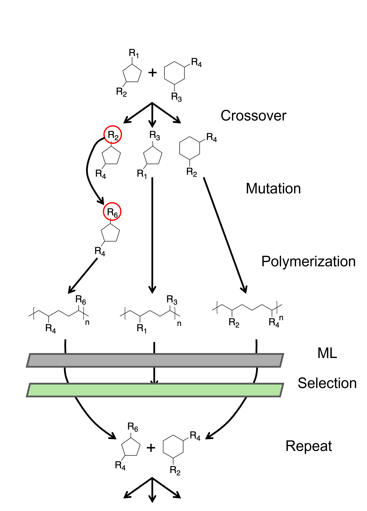

## The Genetic Algorithm in words

As mentioned earlier, this GA's task is to look for the best possible combinations of R-groups and scaffolds that achieve user-defined target property.

**Step 1: Initial Population** The GA generates the initial population of monomers by creating an equal number of scaffolds and then randomly assigning R-groups to their functionalization sites. These monomers are then polymerized, fingerprinted, and their values predicted.
**Step 2: Selection** Using the fitness function (see paper) which is based on user-defined properties, the polymers are ranked and selected for the next generation.
**Step 3: Crossover** The monomers of the top-performing polymers are then crossed-over as seen in the figure below. The R-groups are pooled together, the children get assigned the scaffolds and new R-groups are randomly chosen from this pool.
**Step 4: Mutation** if all combination of children have been seen by the GA before, then the monomer undergoes mutation which essentially swaps one of the R-groups with another from the global list of R-groups (not the pool of R-groups obtained from the parents). Mutation also occurs randomly after all the off-spring have been made. This also enables the GA to maintain diversity and avoid getting stuck in local minima.
**Step 5: Repeat** The new off-spring are then polymerized, fingerprinted, and their values predicted. The GA ranks these children, and then selects the top candidates for the next generation. 

A schematic representing this specific GA is displayed below (this schematic starts with the monomers of the top polymers). 

The user must provide the following:

1. A list of scaffolds and functionalization sites with some scaffolds having at least two sites for diversification
2. A global list of R-groups that could be attached into the scaffold at the functionalization sites
3. Reaction templates that polymerizes the monomers written in SMARTS Format (check script below)
4. A list of properties and their target values. For example this could be 
    a. Young Modulus $> 2$ GPa
    b. Enthalpy $> -20$ kJ/mole
    c. Decomposition Temperature $>473$ K
5. A function to fingerprint all Polymers
6. A function to predict/fetch the values of properties

Each of these are to be defined in the bottom run script. 

Some General Tips:
1. The fingerprint and predict functions take in a Python list of "Polymer". This is a Pydantic class that contains information about reaction templates, base monomer, fingerprinting, predicted values. The user must understand this structure in order to implement these functions. For further info read [Pydantic files for this project](pvfsga/models.py) 
2. The current implementation of the GA only maximizes values, meaning it aims to achieve values above the user-defined targets for each property. In order to minimize a certain value, use the additive inverse of this value and then transform back the values during post-processing. 
3. Preferably, the user should use over 100 R-groups so that the GA can diversify and find the best solutions. If the dataset contains a small number of total combinations ~10,000, then perhaps brute force is a more efficient way. 
4. For large numbers of R-groups $>1000$, we recommend that you run the GA more than once (3-4 times) and then pool all the results together. This will allow the GA to see all R-groups at least once and test whether they are right for the target properties. Afterwards, drop any duplicates you may find during these runs to streamline any post-processing work. 

## SQL database generated
An SQLite database is generated for each GA run, containing comprehensive information about all generated polymers and monomers. These include SMILES, generation numbers, fingerprints, predicted values, fitness values, R-group mappings, and reaction templates. A figure of the schema is displayed below.

